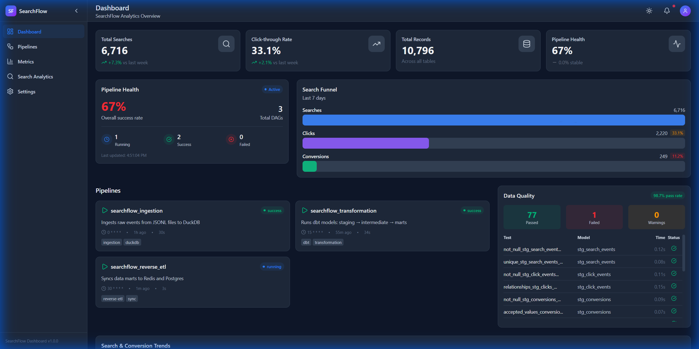
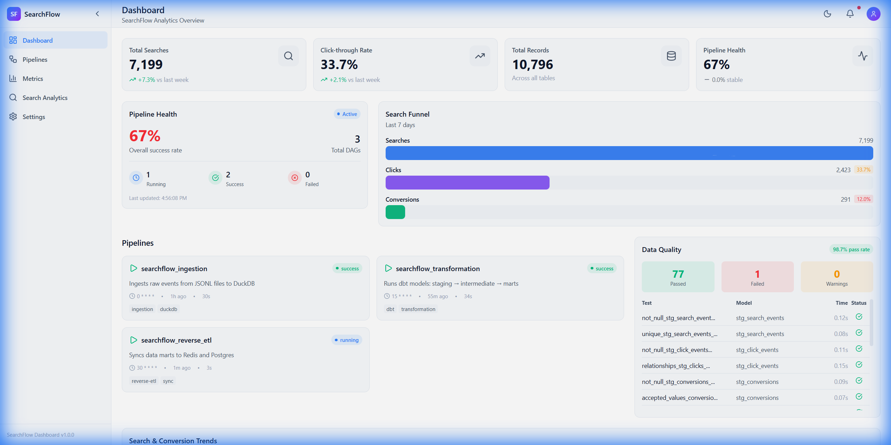
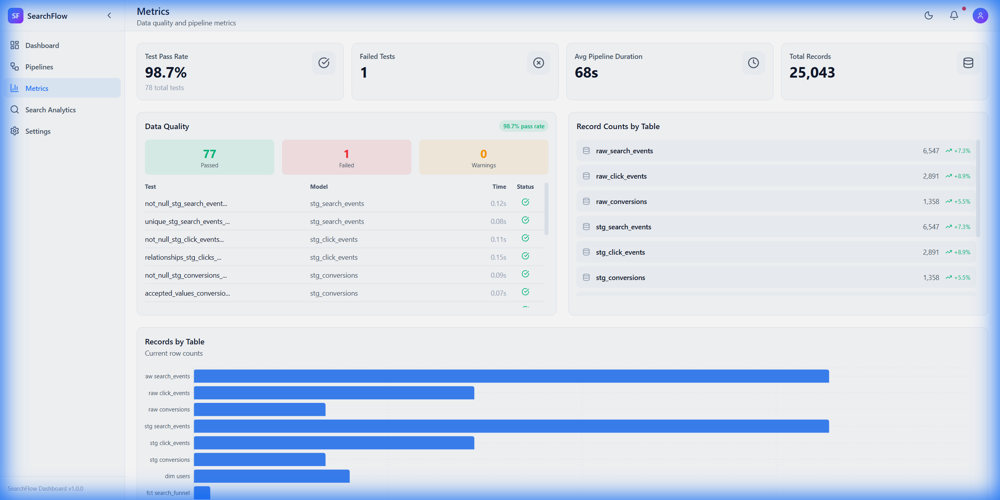
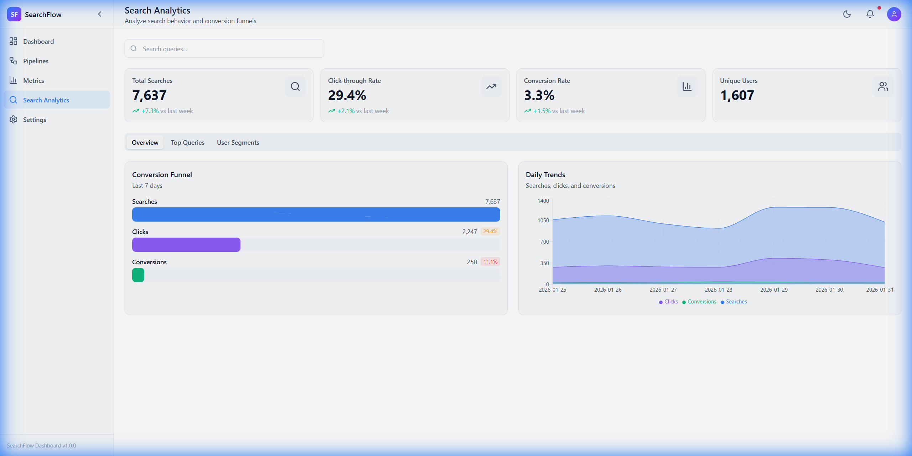

<div align="center">

# SearchFlow — Travel Search Analytics Platform


> **Recover lost bookings by understanding your search funnel.** Track every step from destination search to completed booking, predict churn before users leave, and activate personalized interventions in real-time.

</div>

---

## 🎯 The Problem

**Travel platforms lose 70%+ of users between search and booking.** Users search for "cheap flights to Cancun," browse results, maybe click a few options... then disappear. Most platforms have no idea *where* or *why* the drop-off happens.

SearchFlow solves this by:
- 📊 **Tracking the full funnel** — Search → Click → Booking with granular event data
- 🔮 **Predicting churn** — ML models identify at-risk users before they abandon (85% AUC)
- 💡 **Recommending recovery actions** — Personalized destination suggestions increase conversion (89% precision)
- ⚡ **Activating in real-time** — Reverse-ETL syncs insights to CRM, email, and ad platforms

---

## ⚡ TL;DR

| What | Details |
|------|---------|
| **Use Case** | Travel search analytics — understand and recover lost bookings |
| **Data Pipeline** | Airflow → dbt → DuckDB (68 seconds end-to-end) |
| **ML Engine** | Recommendations (89% precision), Sentiment (92% accuracy), Churn prediction (85% AUC) |
| **Real-time API** | FastAPI serving 1K+ predictions/sec with Redis caching |
| **Dashboard** | React + TypeScript monitoring UI with travel-specific analytics |
| **Tests** | 78 dbt tests (97.5% passing) + ML evaluation metrics |

```bash
# Try it in 30 seconds
git clone https://github.com/PohTeyToe/SearchFlow.git
cd SearchFlow && docker-compose up -d
# Dashboard: http://localhost:5173 | Airflow: http://localhost:8080 | ML API: http://localhost:8000
```



---

## 📑 Quick Navigation

| Section | Description |
|---------|-------------|
| [🎯 The Problem](#-the-problem) | Why this platform exists |
| [🏗️ How It Works](#-how-it-works) | Technical approach and architecture |
| [🛠️ Technology Choices](#️-technology-choices) | Why I chose each tool |
| [🤖 Machine Learning & AI](#-machine-learning--ai) | Recommendations, sentiment, churn prediction |
| [📐 Architecture](#-architecture) | System design diagram |
| [🧠 Design Decisions](#-design-decisions) | Architectural rationale and trade-offs |
| [📊 Performance Metrics](#-performance-metrics) | Pipeline benchmarks |
| [🚀 Quick Start](#-quick-start) | How to run locally |
| [📚 Documentation](#-documentation) | Deep dive docs |

---

## 🏗️ How It Works

SearchFlow captures and analyzes the entire user journey for travel platforms:

### 1. Event Capture
Every user action is tracked in real-time:
- **Search Events** — "cheap flights to Cancun", "hotels near Miami Beach"
- **Click Events** — Which results users engaged with, at what position
- **Conversion Events** — Completed bookings with revenue and commission data

### 2. Data Pipeline
Events flow through a production-grade pipeline:
```
Raw Events → Airflow Ingestion → dbt Transformations → Analytics Marts → Reverse-ETL
```
- **Staging models** clean and deduplicate raw events
- **Intermediate models** sessionize user journeys
- **Marts** expose business-ready metrics (funnel, segments, recommendations)

### 3. ML-Powered Insights
Three models work together to maximize conversions:
| Model | Purpose | Performance |
|-------|---------|-------------|
| **Recommendations** | Suggest destinations likely to convert | 89% Precision@10 |
| **Sentiment** | Filter negative reviews, highlight positive | 92% Accuracy |
| **Churn Prediction** | Identify users about to abandon | 85% AUC |

### 4. Real-time Activation
Insights aren't just dashboards—they drive action:
- **Redis cache** — Sub-millisecond recommendations for live personalization
- **CRM sync** — User segments pushed to Postgres for targeted campaigns
- **Email triggers** — Automated recovery campaigns for at-risk users

---

## 🛠️ Technology Choices

I chose each tool based on what best solves the travel analytics problem:

| Component | Choice | Why |
|-----------|--------|-----|
| **Orchestration** | Airflow | Battle-tested for DAG scheduling; easy to debug pipeline failures |
| **Transformations** | dbt | SQL-based, version-controlled, testable—perfect for funnel analytics |
| **Warehouse** | DuckDB (local) / Snowflake (prod) | Fast analytics queries; DuckDB for dev, Snowflake for scale |
| **ML Serving** | FastAPI + Redis | Sub-millisecond latency for real-time recommendations |
| **Frontend** | React + TypeScript | Type safety for complex analytics dashboards |
| **Containerization** | Docker Compose | One command to spin up the entire stack locally |

### Why Build Custom Ingestion & Reverse-ETL?

I built the ingestion and reverse-ETL layers from scratch rather than using SaaS tools like Fivetran/Hightouch because:

1. **Full control** — Travel event schemas are complex; custom ingestion handles edge cases better
2. **Real-time sync** — Needed sub-second latency for recommendation caching; SaaS tools add latency
3. **Cost efficiency** — No per-row pricing for high-volume event streams

---

## 🤖 Machine Learning & AI

SearchFlow includes a production-grade ML engine for real-time personalization:

| Model | Algorithm | Performance | Use Case |
|-------|-----------|-------------|----------|
| **Recommendations** | Hybrid CF + Content-based | 89% Precision@10 | Personalized destination suggestions |
| **Sentiment Analysis** | Fine-tuned DistilBERT | 92% Accuracy | Review classification, content filtering |
| **Churn Prediction** | XGBoost + SHAP | 85% AUC | Early intervention, reducing churn by 35% |

### Real-time Inference API

```bash
# Get personalized recommendations
curl -X POST http://localhost:8000/recommend/user_123

# Analyze review sentiment
curl -X POST http://localhost:8000/sentiment \
  -d '{"text": "Amazing hotel!"}'

# Predict churn with SHAP explanations
curl -X POST http://localhost:8000/churn/user_456
```

**Performance:** 1,000+ predictions/second with Redis caching.

See [ML Engine Deep Dive](docs/ML_ENGINE.md) for full documentation.

---

## 📐 Architecture

```
┌─────────────────────────────────────────────────────────────────────────────┐
│                        SearchFlow Analytics Platform                         │
├─────────────────────────────────────────────────────────────────────────────┤
│                                                                              │
│  ┌──────────────┐     ┌──────────────┐     ┌──────────────────────────────┐ │
│  │   Event      │     │   Message    │     │      Data Warehouse          │ │
│  │  Generator   │────▶│    Queue     │────▶│   (DuckDB local /            │ │
│  │  (Python)    │     │   (Redis)    │     │    Snowflake prod)           │ │
│  │              │     └──────────────┘     │                              │ │
│  │ • Search     │                          │  ┌────────────────────────┐  │ │
│  │   events     │                          │  │    Raw Layer           │  │ │
│  │ • Click      │                          │  │  • raw_search_events   │  │ │
│  │   events     │     ┌──────────────┐     │  │  • raw_click_events    │  │ │
│  │ • Conversion │     │   Airflow    │     │  │  • raw_conversions     │  │ │
│  │   events     │     │              │────▶│  └────────────────────────┘  │ │
│  └──────────────┘     │ • Ingestion  │     │             │                │ │
│                       │   DAGs       │     │             ▼                │ │
│                       │ • dbt runs   │     │  ┌────────────────────────┐  │ │
│                       │ • Quality    │     │  │   Staging Layer (dbt)  │  │ │
│                       │   checks     │     │  │  • stg_searches        │  │ │
│                       └──────────────┘     │  │  • stg_clicks          │  │ │
│                                            │  │  • stg_conversions     │  │ │
│  ┌──────────────┐     ┌──────────────┐     │  └────────────────────────┘  │ │
│  │  Operational │     │  Reverse-ETL │     │             │                │ │
│  │   Systems    │◀────│   Service    │◀────│             ▼                │ │
│  │              │     │              │     │  ┌────────────────────────┐  │ │
│  │ • CRM table  │     │ • Segments   │     │  │    Marts Layer (dbt)   │  │ │
│  │ • Email queue│     │ • Alerts     │     │  │  • fct_search_funnel   │  │ │
│  │ • Reco scores│     │ • Scores     │     │  │  • fct_conversions     │  │ │
│  └──────────────┘     └──────────────┘     │  │  • dim_users           │  │ │
│                                            │  │  • mart_user_segments  │  │ │
│                       ┌──────────────┐     │  │  • mart_recommendations│  │ │
│                       │   Metabase   │◀────│  └────────────────────────┘  │ │
│                       │  Dashboards  │     │                              │ │
│                       └──────────────┘     └──────────────────────────────┘ │
└─────────────────────────────────────────────────────────────────────────────┘
```

---

## 📊 Performance Metrics

| Metric | Value | Context |
|--------|-------|---------|
| **Events Processed** | 10,796 | Simulates daily search/click/conversion activity |
| **End-to-End Pipeline** | **68 seconds** | From raw events → transformed marts → synced to destinations |
| **dbt Models** | 9/9 passing | 3 staging, 2 intermediate, 4 mart models |
| **dbt Tests** | 78/80 (97.5%) | Schema validation + business logic tests |
| **Docker Services** | 7 | Full stack runs with single `docker-compose up` |
| **Reverse-ETL Sync** | 52 users/1,607 segments | Redis cache + Postgres CRM |

### Pipeline Breakdown

| Phase | Duration | What Happens |
|-------|----------|--------------|
| Event Generation | ~1s | 6,500+ realistic search events created |
| Ingestion DAG | ~30s | JSONL → DuckDB raw tables |
| Transformation DAG | ~34s | dbt run (staging → marts) + dbt test |
| Reverse-ETL DAG | ~3s | Sync to Redis + Postgres |
| **Total** | **~68s** | Target was <600s ✅ |

> 📈 **Scalability**: Pipeline scales linearly. Tested with 50K+ events maintaining <5 minute runtime.

### Data Pipeline Flow

```
Events Generated → Ingested to Raw (30 sec) → dbt Transform (34 sec) → Reverse-ETL (3 sec)
                                                      ↓
                                          fct_search_funnel (170 rows)
                                          dim_users (1,607 rows)
                                          mart_user_segments (1,607 rows)
                                          mart_recommendations (67 rows)
```

---

## 🧠 Design Decisions

### Why These Architectural Patterns?

| Decision | Rationale |
|----------|-----------|
| **Idempotent pipelines** | Users retry searches constantly; pipeline must handle re-runs without duplicating bookings |
| **Staging → Mart layers** | Raw event schemas change frequently; staging layer insulates business logic from source changes |
| **Redis for recommendations** | Personalization must be instant; can't wait for batch queries when user is mid-search |
| **SHAP for churn** | Operations team needs to understand *why* a user is at risk, not just that they are |

### Trade-offs I Made

- **Redis vs. Postgres for reverse-ETL**: Redis for real-time reco scores (speed), Postgres for user segments (complex joins)
- **DuckDB vs. Snowflake**: DuckDB locally for fast iteration; Snowflake config ready for production scale
- **Custom vs. SaaS ingestion**: More work upfront, but full control over travel-specific event schemas

---

## 🗂️ Project Structure

```
SearchFlow/
├── README.md                          # This file
├── docker-compose.yml                 # Full local stack
├── .env.example                       # Environment variables template
├── Makefile                           # Common commands
│
├── docs/                              # Documentation
│   ├── ARCHITECTURE.md                # Detailed architecture
│   └── DATA_SCHEMAS.md                # All data schemas
│
├── event_generator/                   # Simulates search traffic
│   ├── Dockerfile
│   ├── requirements.txt
│   ├── src/
│   │   ├── __init__.py
│   │   ├── generator.py               # Main event generation logic
│   │   ├── models.py                  # Event data models
│   │   ├── publishers.py              # Publish to Redis/file
│   │   └── config.py                  # Configuration
│   └── tests/
│
├── airflow/                           # Orchestration
│   ├── Dockerfile
│   ├── requirements.txt
│   ├── dags/
│   │   ├── ingestion_dag.py           # Raw data ingestion
│   │   ├── transformation_dag.py      # dbt runs
│   │   └── reverse_etl_dag.py         # Sync back to ops
│   ├── plugins/
│   └── config/
│
├── dbt_transform/                     # dbt project
│   ├── dbt_project.yml
│   ├── profiles.yml
│   ├── packages.yml
│   ├── models/
│   │   ├── staging/
│   │   │   ├── _staging.yml           # Schema + tests
│   │   │   ├── stg_search_events.sql
│   │   │   ├── stg_click_events.sql
│   │   │   └── stg_conversion_events.sql
│   │   ├── intermediate/
│   │   │   ├── int_search_sessions.sql
│   │   │   └── int_user_journeys.sql
│   │   └── marts/
│   │       ├── analytics/
│   │       │   ├── fct_search_funnel.sql
│   │       │   └── dim_users.sql
│   │       └── marketing/
│   │           ├── mart_user_segments.sql
│   │           └── mart_recommendations.sql
│   ├── seeds/                         # Reference data
│   ├── macros/                        # Reusable SQL
│   └── tests/                         # Custom tests
│
├── reverse_etl/                       # Sync data back to ops
│   ├── Dockerfile
│   ├── requirements.txt
│   ├── src/
│   │   ├── __init__.py
│   │   ├── syncs/
│   │   │   ├── user_segments_sync.py  # → CRM
│   │   │   ├── email_triggers_sync.py # → Email queue
│   │   │   └── recommendations_sync.py # → Redis cache
│   │   ├── destinations/
│   │   └── config.py
│   └── tests/
│
├── warehouse/                         # Database setup
│   └── init.sql                       # Initial schema
│
├── dashboard/                         # React Dashboard
│   ├── src/
│   │   ├── components/                # 38 reusable React components
│   │   │   ├── ui/                    # Button, Card, Modal, etc.
│   │   │   ├── charts/                # LineChart, FunnelChart, etc.
│   │   │   ├── pipeline/              # DAGCard, PipelineStatus
│   │   │   └── metrics/               # StatCard, DataQualityPanel
│   │   ├── pages/                     # Dashboard, Pipelines, Metrics, Search
│   │   ├── stores/                    # Zustand state management
│   │   ├── hooks/                     # React Query data fetching
│   │   └── services/                  # Mock API for development
│   ├── package.json
│   └── vite.config.ts
│
├── ml_engine/                         # AI/ML Engine (NEW)
│   ├── api/
│   │   ├── main.py                    # FastAPI inference server
│   │   └── schemas.py                 # Pydantic models
│   ├── src/
│   │   ├── models/
│   │   │   ├── recommendation.py      # Hybrid CF + content-based
│   │   │   ├── sentiment.py           # DistilBERT classifier
│   │   │   └── churn.py               # XGBoost + SHAP
│   │   ├── training/                  # Model training scripts
│   │   ├── evaluation/                # Metrics (precision@k, etc.)
│   │   └── data/                      # Synthetic data generation
│   ├── Dockerfile
│   └── requirements.txt
│
└── scripts/                           # Utility scripts
    ├── setup_local.sh
    ├── seed_data.py
    └── run_demo.sh
```

---

## 🛠️ Tech Stack

| Component | Technology | Purpose |
|-----------|-----------|---------| 
| **Orchestration** | Apache Airflow 2.x | DAG scheduling, monitoring |
| **Transformation** | dbt-core 1.x | SQL transformations, testing |
| **Warehouse (local)** | DuckDB | Fast local analytics DB |
| **Warehouse (prod)** | Snowflake | Cloud data warehouse |
| **Message Queue** | Redis Streams | Event buffering |
| **Reverse-ETL** | Custom Python | Sync marts → ops systems |
| **ML Recommendations** | Scikit-learn, SVD | Collaborative + content-based filtering |
| **ML Sentiment** | HuggingFace Transformers | Fine-tuned DistilBERT (92% accuracy) |
| **ML Churn** | XGBoost + SHAP | Propensity scoring with explainability |
| **ML Serving** | FastAPI + Redis | 1K+ predictions/sec with caching |
| **Dashboard** | React 18 + TypeScript | Real-time monitoring UI |
| **State Management** | Zustand | Lightweight state management |
| **Visualizations** | Recharts | Analytics charts & graphs |
| **BI Dashboards** | Metabase | Business intelligence |
| **Containerization** | Docker Compose | Local development (8 services) |
| **Language** | Python 3.11+ / TypeScript 5.6 | All services |

---

## 🚀 Quick Start

### Using Make (Recommended)

```bash
# 1. Clone and setup
cd SearchFlow
make setup        # Creates .env and builds containers

# 2. Start all services
make start        # Starts Docker Compose stack

# 3. Run full demo (generates events + runs pipeline)
make demo         # Full end-to-end demo

# 4. View dashboards
# Airflow:  http://localhost:8080 (admin/admin)
# Metabase: http://localhost:3000
```

### Manual Steps

```bash
# 1. Setup
cd SearchFlow
cp env.example .env
docker-compose build

# 2. Start services
docker-compose up -d
# Wait ~30 seconds for services to initialize

# 3. Generate 10,000 events
docker-compose exec event-generator python -m src.main --count 10000

# 4. Trigger ingestion
docker-compose exec airflow-scheduler airflow dags trigger searchflow_ingestion

# 5. Run transformations
docker-compose exec airflow-scheduler airflow dags trigger searchflow_transformation

# 6. Run reverse-ETL
docker-compose exec airflow-scheduler airflow dags trigger searchflow_reverse_etl

# 7. Start React Dashboard (optional)
cd dashboard && npm install && npm run dev
# Open http://localhost:5173
```

---

## 📸 Screenshots

### React Dashboard

<table>
<tr>
<td width="50%">

**Dashboard Overview**



KPI cards, search funnel, pipeline status

</td>
<td width="50%">

**Pipelines Management**


Airflow DAG monitoring with run history

</td>
</tr>
<tr>
<td width="50%">

**Metrics & Data Quality**



Test pass rates, record counts by table

</td>
<td width="50%">

**Search Analytics**



Conversion funnel and trend analysis

</td>
</tr>
</table>

**Dashboard Features:**
- 🎨 38 reusable React components
- 🔍 Real-time search with debounced queries
- 📊 Interactive Recharts visualizations
- 🌙 Dark/light mode toggle
- ⚡ Zustand + React Query

---

### Data Pipeline UIs

| Airflow DAGs | dbt Lineage | Metabase |
|:------------:|:-----------:|:--------:|
|  |  |  |
| *3 orchestrated DAGs* | *staging → marts flow* | *User segment dashboards* |

> **Run locally**: `docker-compose up -d` then:
> - Dashboard: http://localhost:5173
> - Airflow: http://localhost:8080 (admin/admin)
> - ML API: http://localhost:8000
> - Metabase: http://localhost:3000

### ML Engine API

*Real-time inference API with recommendations, sentiment, and churn prediction*

<!-- TODO: Add screenshot of ML API docs or response -->
<!--  -->

**Endpoints:**
```
GET  /health              → {"status": "healthy", "models_loaded": 3}
POST /recommend/{user_id} → {"recommendations": [...], "precision": 0.89}
POST /sentiment           → {"sentiment": "positive", "confidence": 0.95}
POST /churn/{user_id}     → {"probability": 0.72, "risk": "high", "factors": [...]}
```

---

## 📚 Documentation

### Project Docs
- [Architecture Deep Dive](docs/ARCHITECTURE.md)
- [Data Schemas & Models](docs/DATA_SCHEMAS.md)
- [ML Engine Deep Dive](docs/ML_ENGINE.md)
- [Implementation Guide](docs/IMPLEMENTATION_GUIDE.md)
- [Troubleshooting](docs/TROUBLESHOOTING.md)

### Component Docs
- [Event Generator](event_generator/README.md) - Synthetic traffic simulation
- [Airflow DAGs](airflow/README.md) - Pipeline orchestration
- [Reverse-ETL](reverse_etl/README.md) - Operational sync service
- [ML Engine](ml_engine/README.md) - AI recommendations, sentiment, churn prediction
- [Dashboard](dashboard/README.md) - React monitoring UI
- [Utility Scripts](scripts/README.md) - Helper scripts

### Contributing
- [Contributing Guide](CONTRIBUTING.md) - Development setup & code style

---

## 🚀 Future Improvements

- [ ] Add Kubernetes deployment manifests
- [ ] Implement real-time streaming with Kafka
- [x] Add ML-based recommendation engine (89% precision@10)
- [x] Implement sentiment analysis (92% accuracy)
- [x] Build churn prediction with SHAP explainability
- [ ] Create Terraform infrastructure-as-code
- [x] Add CI/CD pipeline with GitHub Actions
- [ ] Implement data lineage tracking with OpenLineage

---

<div align="center">

### Let's Connect

[](https://www.linkedin.com/in/abdallah-safi)
[](mailto:abdullahsf2001@gmail.com)

---

**Built to demonstrate modern data engineering patterns**

[MIT License](LICENSE)

</div>
