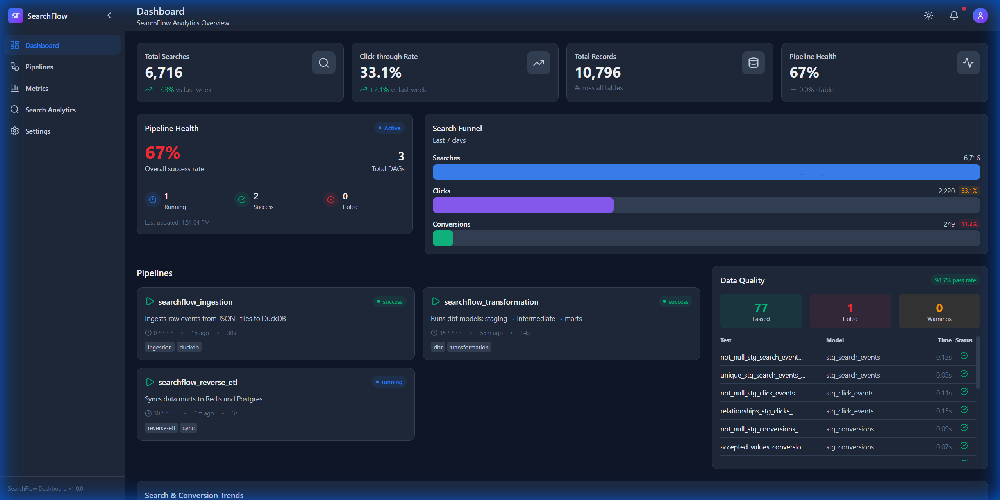
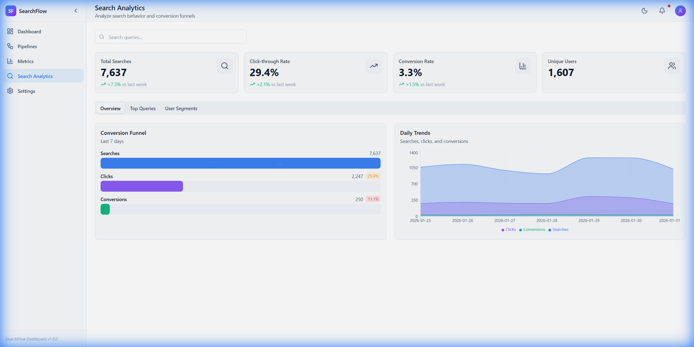
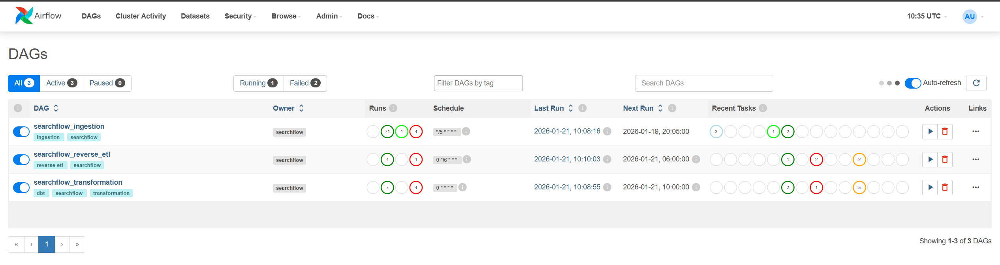
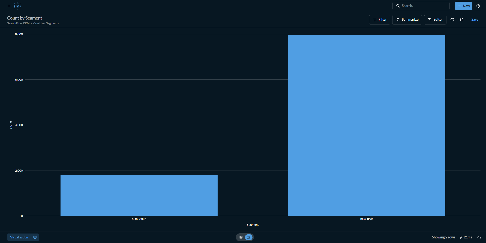

# SearchFlow

End-to-end travel search analytics pipeline that tracks the search-to-booking funnel, predicts churn, and generates recommendations. Built to explore how modern data teams build analytics pipelines -- from event generation through ML-powered predictions, simulating a travel booking site's search-to-conversion funnel.

**Live Demo:** [Dashboard](https://dashboard-nine-lilac-71.vercel.app) | [ML API (Swagger)](https://searchflow-ml-api.onrender.com/docs)


```bash
git clone https://github.com/PohTeyToe/SearchFlow.git
cd SearchFlow && docker-compose up -d
# Dashboard: http://localhost:5173 | Airflow: http://localhost:8080 | ML API: http://localhost:8000
```

## Screenshots

| Dashboard (Dark) | Search Analytics |
|-------|-----------|
|  |  |

| Airflow DAGs | Metabase Dashboard |
|-------|-----------|
|  |  |

---

## What It Does

Travel platforms lose most users between search and booking. SearchFlow captures the full funnel (search, click, booking), identifies where drop-off happens, and activates interventions:

- **Funnel tracking** -- Search, click, and conversion events with session context
- **Churn prediction** -- XGBoost model flags at-risk users with SHAP explanations
- **Recommendations** -- Hybrid collaborative + content-based filtering (SVD)
- **Batch analytics** -- PySpark session analysis and user segmentation
- **Reverse-ETL** -- Syncs insights back to CRM, email queue, and Redis cache

## Architecture

```
Events Generated --> Airflow Ingestion --> dbt Transform --> Reverse-ETL
                                                |
                                    fct_search_funnel (170 rows)
                                    dim_users (1,607 rows)
                                    mart_user_segments (1,607 rows)
                                    mart_recommendations (67 rows)
```

| Component | Technology |
|-|-|
| Orchestration | Airflow |
| Transformations | dbt-core + DuckDB |
| ML Serving | FastAPI + Redis |
| Recommendations | Scikit-learn SVD (hybrid CF + content-based) |
| Sentiment | TF-IDF baseline + PyTorch DistilBERT |
| Churn | XGBoost + SHAP |
| Batch Analytics | PySpark |
| Dashboard | React + TypeScript + Recharts |
| Load Testing | Locust |

## ML Engine

Three models served via FastAPI with Redis caching:

| Model | Algorithm | Purpose |
|-|-|-|
| Recommendations | Hybrid CF + Content-based (SVD) | Personalized destination suggestions |
| Sentiment | TF-IDF + DistilBERT | Review classification |
| Churn | XGBoost + SHAP | Propensity scoring with explainability |

```bash
# Get recommendations
curl -X POST http://localhost:8000/recommend/user_123

# Analyze sentiment
curl -X POST http://localhost:8000/sentiment -d '{"text": "Amazing hotel!"}'

# Predict churn
curl -X POST http://localhost:8000/churn/user_456
```

### PyTorch Training

```bash
cd ml_engine
python -m src.models.train_sentiment_pytorch --samples 5000 --epochs 5
```

### PySpark Jobs

```bash
docker-compose exec spark spark-submit /app/session_analysis.py --data-dir /data/raw
docker-compose exec spark spark-submit /app/user_segmentation.py
```

## Architecture Decisions

Key design choices and the reasoning behind them:

- **FastAPI over Flask/Django for ML serving** — FastAPI's async support handles concurrent prediction requests without blocking, and its automatic OpenAPI documentation means the ML API is self-documenting. Pydantic validation catches malformed requests before they hit the model.

- **dbt for data transformations** — Version-controlled SQL transformations with built-in testing (schema tests, data tests) and automatic documentation. Easier to audit and debug than raw SQL scripts or pandas pipelines for the transformation layer.

- **Redis for prediction caching** — Sub-millisecond reads for repeated predictions on the same input. TTL-based expiration keeps cache fresh without manual invalidation. Simple key-value model fits the input-hash → prediction-result pattern.

- **Event-driven architecture with generators** — Decouples data generation from processing. Multiple consumers can independently process the same event stream. Supports replay for debugging and reprocessing.

- **Monorepo with Docker Compose** — Single `docker-compose up` starts all 7 services. Shared networking simplifies service discovery. Easier to develop and test locally than separate repos with inter-service dependencies.

## Quick Start

```bash
# Using Make
cd SearchFlow
make setup && make start && make demo

# Manual
cp env.example .env
docker-compose build && docker-compose up -d
docker-compose exec event-generator python -m src.main --count 10000
docker-compose exec airflow-scheduler airflow dags trigger searchflow_ingestion
docker-compose exec airflow-scheduler airflow dags trigger searchflow_transformation
docker-compose exec airflow-scheduler airflow dags trigger searchflow_reverse_etl

# Dashboard (optional)
cd dashboard && npm install && npm run dev
```

**URLs:**
- Dashboard: http://localhost:5173
- Airflow: http://localhost:8080 (admin/admin)
- ML API: http://localhost:8000
- Metabase: http://localhost:3000

## Performance

| Metric | Value |
|-|-|
| End-to-end pipeline | ~68 seconds |
| dbt models | 9/9 passing |
| dbt tests | 80 |
| Python tests | 50+ (pytest) |
| Docker services | 10 |

## Testing

```bash
cd ml_engine && python -m pytest tests/ -v
cd event_generator && python -m pytest tests/ -v
cd reverse_etl && python -m pytest tests/ -v

# Load testing
./benchmarks/run_benchmark.sh http://localhost:8000 100 10 60s
```

## Project Structure

```
SearchFlow/
├── event_generator/       # Synthetic search traffic simulation
├── airflow/               # DAG orchestration (ingestion, transform, reverse-ETL)
├── dbt_transform/         # SQL transformations (staging -> intermediate -> marts)
├── ml_engine/             # Recommendations, sentiment, churn (FastAPI serving)
├── spark/                 # PySpark batch analytics
├── reverse_etl/           # Sync marts to CRM, email queue, Redis
├── dashboard/             # React + TypeScript monitoring UI
├── warehouse/             # DuckDB schema init
├── benchmarks/            # Locust load testing
└── scripts/               # Setup and demo utilities
```

## Docs

- [Architecture](docs/ARCHITECTURE.md)
- [Data Schemas](docs/DATA_SCHEMAS.md)
- [ML Engine](docs/ML_ENGINE.md)
- [Implementation Guide](docs/IMPLEMENTATION_GUIDE.md)
- [Troubleshooting](docs/TROUBLESHOOTING.md)

## Deployment

### Dashboard (Vercel)
The React dashboard can be deployed to Vercel directly from the `dashboard/` directory:
1. Connect the repository on [Vercel](https://vercel.com)
2. Set the root directory to `dashboard`
3. Framework preset: Vite
4. Deploy

### ML API (Render)
The FastAPI ML engine can be deployed to Render:
1. Connect the repository on [Render](https://render.com)
2. Select "Docker" runtime
3. Set Dockerfile path to `ml_engine/Dockerfile`
4. Configure environment variables (see `.env.example`)

See live links at the top of this README.

## Known Issues

- Redis cache invalidation is TTL-based only — no event-driven invalidation when models are retrained
- PySpark jobs run in local mode; cluster deployment would need Spark standalone or YARN configuration
- ML model serving doesn't support batch predictions (single-request only via REST)
- Dashboard auth is placeholder — no actual user authentication implemented
- Event generator timestamps use system clock, which can drift in containerized environments

## Roadmap

- [ ] Kafka integration to replace Redis pub/sub for event streaming
- [ ] Batch prediction endpoint for bulk inference requests
- [ ] Grafana + Prometheus monitoring for ML model performance metrics
- [ ] Airflow DAG integration for PySpark jobs (currently manual execution)
- [ ] Model A/B testing framework for comparing prediction quality across versions

---

[MIT License](LICENSE)
