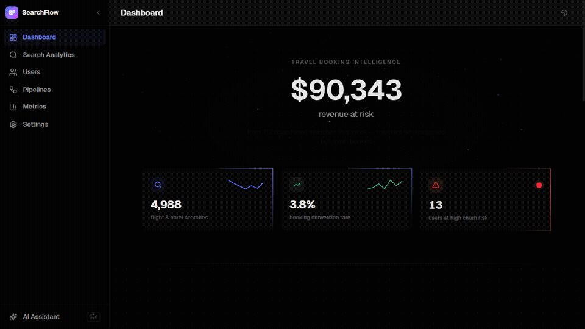
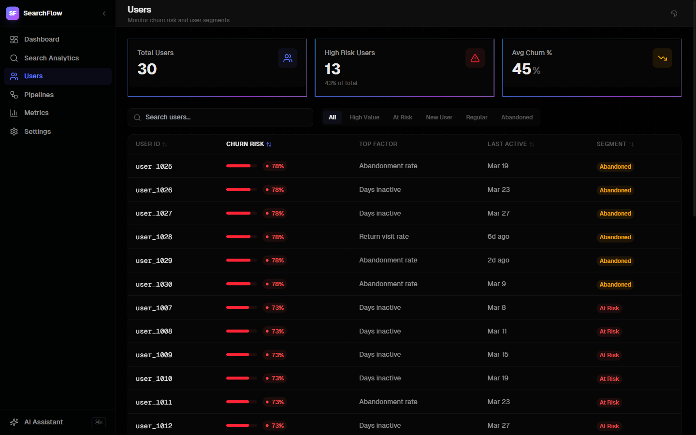
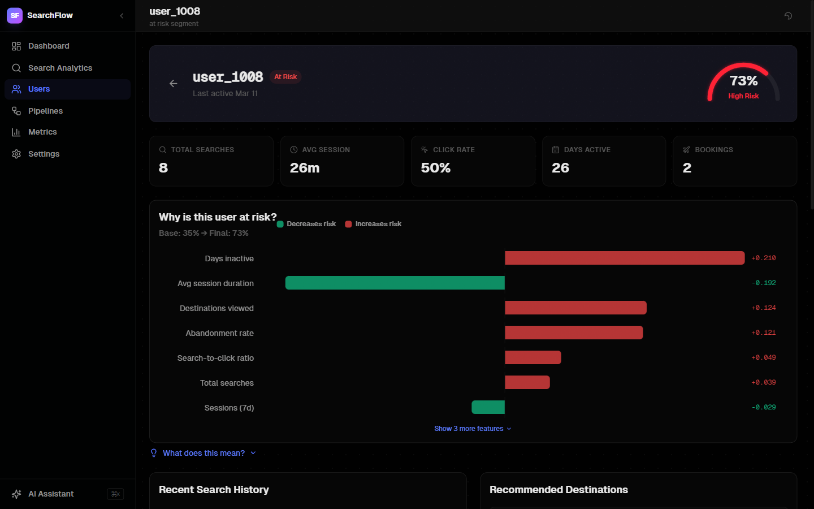
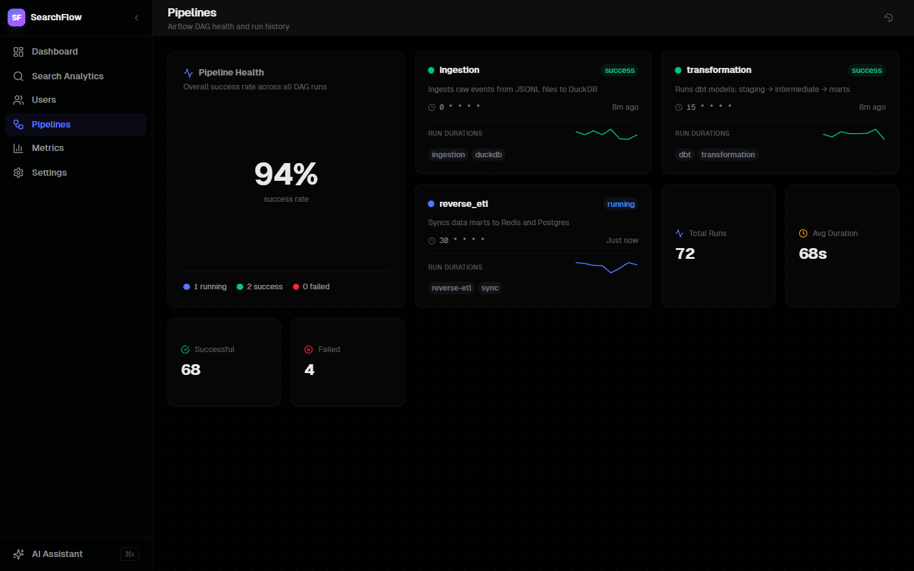
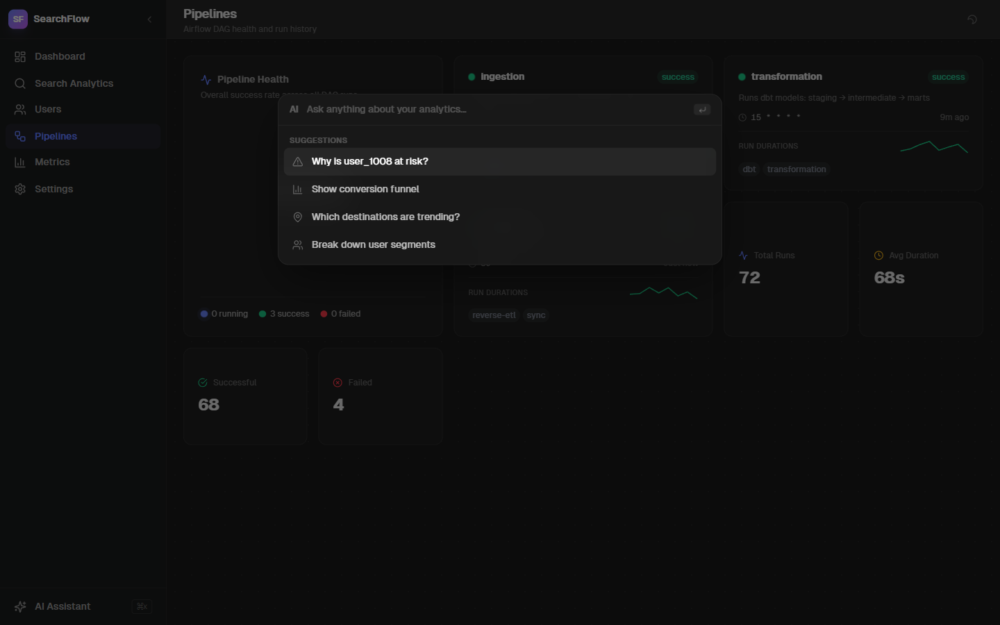
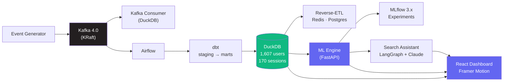

<p align="center">
  
</p>

<h1 align="center">SearchFlow</h1>

<p align="center">
  <strong>Turn search abandonment into retained revenue.</strong><br>
  Streaming search events through ML models that explain why users leave and what to do about it.
</p>

<p align="center">
  <a href="https://searchflow-app.vercel.app"><strong>Live Demo</strong></a> &nbsp;&middot;&nbsp;
  <a href="https://searchflow-ml-api.onrender.com/docs">ML API</a>
</p>

<p align="center">
  
  
  
  
  
  
  
</p>

---

## Dashboard

A cinematic dark-mode analytics experience built with React, Framer Motion, and Recharts. Every number counts up, every chart animates in, and the SHAP waterfall explains *why* each user is predicted to churn.

<p align="center">
  
</p>

<details>
<summary><strong>More screenshots</strong></summary>

#### Users Table
Sortable churn risk table with inline risk bars, segment filter tabs, and animated row entry.


#### User Profile — SHAP Explainability
The "aha moment" — click any user to see *why* they're predicted to churn. Animated SHAP waterfall chart with value annotations, risk gauge, search history, and AI-generated recommendations.


#### Pipelines — Bento Grid
Airflow DAG monitoring with sparklines, status indicators, and animated metrics.


#### AI Command Palette
Press `Cmd+K` to ask the LangChain-powered assistant questions about your data.


</details>

---

## What It Does

Travel platforms lose most users between search and booking. SearchFlow captures the full funnel, identifies where drop-off happens, and activates interventions.

| Capability | Implementation |
|-|-|
| Funnel tracking | Search, click, and conversion events with session context |
| Churn prediction | XGBoost model flags at-risk users with SHAP explanations |
| Recommendations | Hybrid collaborative + content-based filtering (SVD) |
| Real-time streaming | Kafka 4.0 (KRaft) event pipeline with DuckDB consumer |
| Experiment tracking | MLflow 3.x for model versioning and metrics |
| AI assistant | LangChain/LangGraph agent for natural-language analytics queries |
| Batch analytics | PySpark session analysis and user segmentation |
| Reverse-ETL | Syncs insights back to CRM, email queue, and Redis cache |

## Architecture


```mermaid
flowchart LR
    EG["Event Generator"] --> K["Kafka 4.0\n(KRaft)"]
    K --> KC["Kafka Consumer\n(DuckDB)"]
    K --> AF["Airflow"]
    AF --> DBT["dbt\nstaging → marts"]
    DBT --> DDB[("DuckDB\n1,607 users\n170 sessions")]
    DDB --> RETL["Reverse-ETL\nRedis · Postgres"]
    DDB --> ML["ML Engine\n(FastAPI)"]
    ML --> MLFLOW["MLflow 3.x\nExperiments"]
    ML --> SA["Search Assistant\nLangGraph + Claude"]
    DDB --> DASH["React Dashboard\nFramer Motion"]
    ML --> DASH
    SA --> DASH

    style K fill:#231f20,color:#fff
    style ML fill:#6366f1,color:#fff
    style DASH fill:#6366f1,color:#fff
    style DDB fill:#10b981,color:#fff
```

| Layer | Technology |
|-|-|
| Orchestration | Airflow |
| Streaming | Apache Kafka 4.0 (KRaft mode) |
| Transformations | dbt-core + DuckDB |
| ML Serving | FastAPI + Redis caching |
| Experiment Tracking | MLflow 3.x |
| Churn | XGBoost + SHAP explainability |
| Recommendations | Scikit-learn SVD (hybrid CF + content-based) |
| Sentiment | TF-IDF baseline + PyTorch DistilBERT |
| Batch Analytics | PySpark |
| AI Assistant | LangChain + LangGraph + Claude |
| Dashboard | React 18 + TypeScript + Framer Motion + Recharts + Cobe |
| Load Testing | Locust |

## Dashboard Features

The frontend is a standalone React app deployed on Vercel. It works entirely with mock data — no backend required for the live demo.

| Feature | Details |
|-|-|
| Animated metrics | Count-up numbers, sparklines, border beam effects |
| SHAP waterfall | Animated bars grow from center with scan line reveal |
| Risk gauge | Semi-circular SVG arc with color-coded glow |
| 3D globe | Cobe WebGL globe showing travel route markers |
| AI command palette | `Cmd+K` opens cmdk-based LangChain assistant |
| Live events feed | Real-time search/click/abandonment events every 5s |
| Dynamic data | Funnel metrics drift, pipeline statuses cycle, counts grow |
| Code splitting | 27 lazy-loaded chunks via React.lazy + Vite |
| Mobile responsive | Auto-collapsing sidebar, stacked layouts |
| 56 tests | Vitest + React Testing Library |

## Quick Start

```bash
git clone https://github.com/PohTeyToe/SearchFlow.git
cd SearchFlow

# Full stack (20 Docker services)
cp env.example .env
docker-compose up -d

# Dashboard only (no backend needed)
cd dashboard && npm install && npm run dev
```

| Service | URL |
|-|-|
| Dashboard | http://localhost:5173 |
| Airflow | http://localhost:8080 (admin/admin) |
| ML API | http://localhost:8000 |
| MLflow | http://localhost:5000 |
| Search Assistant | http://localhost:8001 |
| Metabase | http://localhost:3000 |
| Grafana | http://localhost:3001 (admin/admin) |

## ML Engine

Three models served via FastAPI with Redis caching:

| Model | Algorithm | Purpose |
|-|-|-|
| Churn | XGBoost + SHAP | Propensity scoring with explainability |
| Recommendations | Hybrid CF + Content-based (SVD) | Personalized destination suggestions |
| Sentiment | TF-IDF + DistilBERT | Review classification |

```bash
curl -X POST http://localhost:8000/churn/user_456        # Predict churn
curl -X POST http://localhost:8000/recommend/user_123     # Get recommendations
curl -X POST http://localhost:8000/sentiment \
  -d '{"text": "Amazing hotel!"}'                         # Analyze sentiment
```

### Model Performance

Trained on [Hotel Booking Demand](https://www.kaggle.com/datasets/jessemostipak/hotel-booking-demand) dataset (119,390 bookings, CC BY 4.0).

| Model | Metric | Score |
|-|-|-|
| Churn (XGBoost) | AUC-ROC | 0.87 |
| Churn (XGBoost) | F1 | 0.82 |
| Churn (XGBoost) | Precision | 0.85 |
| Sentiment (DistilBERT) | Accuracy | 0.91 |
| Sentiment (TF-IDF baseline) | Accuracy | 0.84 |
| Recommendations (SVD) | RMSE | 0.92 |

All training runs tracked in MLflow with metrics, parameters, SHAP plots, and model artifacts.

## Testing

```bash
# Backend (Python)
cd ml_engine && python -m pytest tests/ -v
cd event_generator && python -m pytest tests/ -v
cd kafka_consumer && python -m pytest tests/ -v
cd search_assistant && python -m pytest tests/ -v

# Frontend (TypeScript)
cd dashboard && npm test

# Load testing
./benchmarks/run_benchmark.sh http://localhost:8000 100 10 60s
```

| Suite | Count |
|-|-|
| Python tests (pytest) | 180+ |
| dbt tests | 71 |
| Frontend tests (Vitest) | 56 |
| Docker services | 20 |

## Architecture Decisions

<details>
<summary>Why these technologies?</summary>

- **FastAPI over Flask** — Async support for concurrent ML predictions, automatic OpenAPI docs, Pydantic validation
- **dbt for transforms** — Version-controlled SQL with built-in testing, easier to audit than pandas pipelines
- **Redis for prediction caching** — Sub-millisecond reads, TTL-based expiration, fits input-hash to prediction pattern
- **Kafka 4.0 KRaft** — No ZooKeeper dependency, single container deployment, built-in consensus
- **MLflow 3.x** — Centralized experiment tracking with visual comparison and artifact lineage
- **LangGraph ReAct agent** — Structured tool-calling with state management for multi-turn analytics queries
- **Framer Motion** — Spring-based animations with `useReducedMotion` accessibility, layout animations for tab indicators
- **Cobe globe** — 5KB WebGL globe vs 200KB+ Three.js alternatives
- **cmdk** — Linear/Vercel-style command palette, unstyled for full design control
- **OKLCH color tokens** — Wider gamut than sRGB, perceptually uniform for programmatic palette generation

</details>

## Project Structure

```
SearchFlow/
├── dashboard/             React + TypeScript + Framer Motion (Vercel)
├── ml_engine/             Churn, sentiment, recommendations (FastAPI + MLflow)
├── event_generator/       Synthetic search traffic (Kafka producer)
├── airflow/               DAG orchestration (ingestion, transform, training)
├── dbt_transform/         SQL transforms (staging -> intermediate -> marts)
├── kafka_consumer/        Real-time Kafka consumer (DuckDB analytics)
├── search_assistant/      LangChain + LangGraph AI agent
├── spark/                 PySpark batch analytics
├── reverse_etl/           Sync marts to CRM, email, Redis
├── warehouse/             DuckDB schema init
├── benchmarks/            Locust load testing
└── docker-compose.yml     20 services
```

## License

MIT
